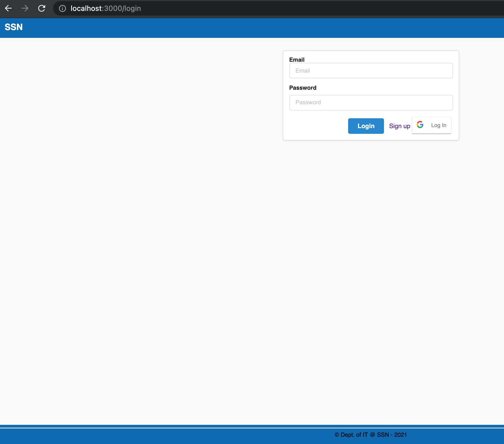
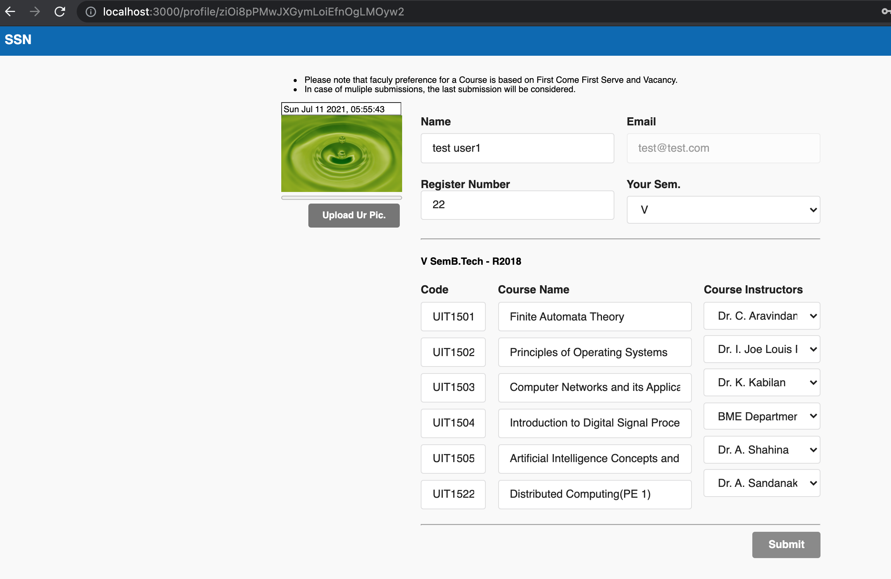
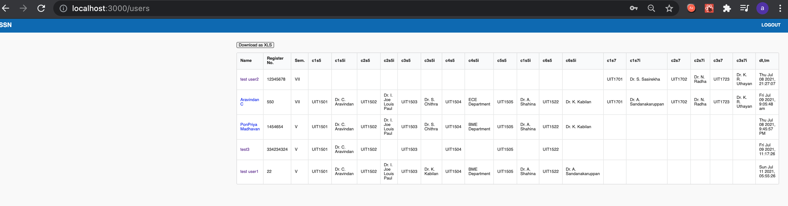

# CBCS mode (time-stamped) Course Registration App. using React and Firebase

This App. was created using [Create React App](https://github.com/facebook/create-react-app) and Firebase

## Setup & Installation:

After cloning/downloading the file, Setup a Firebase project (with setups for Authentication, Firestore, Storage, and Security rules - for admin user) and add the necesssary env, config, service account info., and firestore rules to the app.

From the project directory, run:

### `npm install`

### `npm start`

to Run the app in the development mode.\
Open [http://localhost:3000](http://localhost:3000) to view it in the browser.

Signup -> fill the reg. form -> logout. Login back for any modifications.

For the admin, once a user is created, from the project directory, run:

node src/firebase/set-custom-clainms.js <admin-user-id>

and then, run:

### `npm start`

to Run the app in the development mode.\
Open [http://localhost:3000](http://localhost:3000) to view it in the browser. Login with the admin credentials to retrieve the course registration details of the users in Excel format.

### `Screenshots`
  

